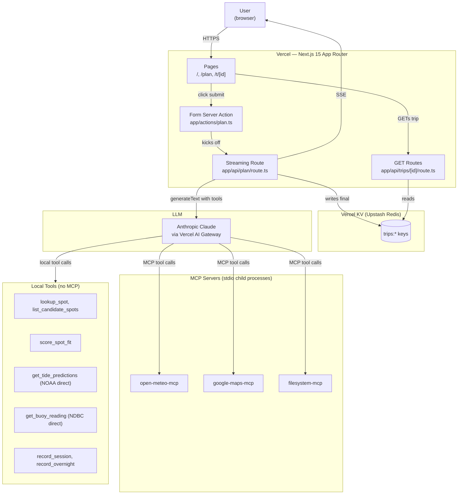
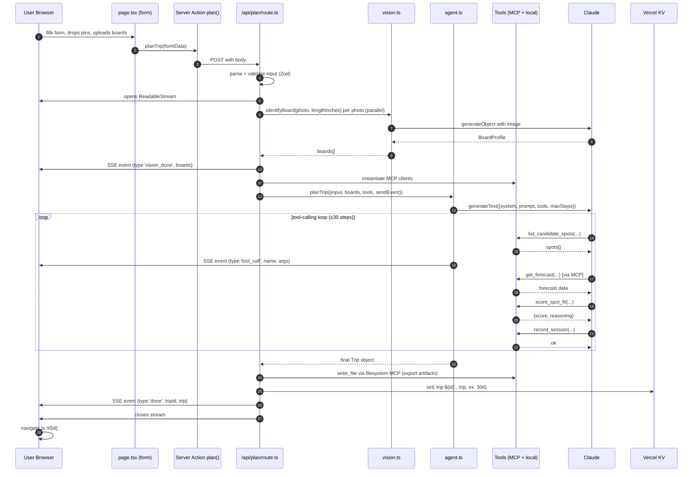

# Architecture — California Surf Trip Planner

This is the canonical architecture reference. Read this fully before writing any code. Re-read sections as needed.

The goal is a Next.js application, deployed publicly on Vercel, that uses an AI agent swarm (Vercel AI SDK + Anthropic Claude) to plan multi-day California surf trips. The agent identifies the user's surfboards from photos, fetches real swell/wind/tide forecasts via MCP servers, plans a day-by-day itinerary, and exports trip artifacts. Trips are persisted in Vercel KV and shareable via random URLs.

This is a **solo, 4–5 hour hackathon build**. Optimize for shipping, not perfection. When trade-offs arise, choose the option that ships in less time over the one that's "more correct."

---

## Operating principles for this codebase

Read these before writing code. They override generic best practices when they conflict.

1. **TypeScript strict mode, but no over-typing.** Use `unknown` over `any` when truly unknown. Use Zod schemas as the source of truth for runtime data shapes — derive TS types via `z.infer<typeof Schema>`. Don't write parallel TS interfaces that duplicate Zod schemas.

2. **Validation at boundaries, not inside.** Every external input (form submission, API response, MCP tool result, KV read) gets parsed through a Zod schema at its entry point. Inside the codebase, types flow naturally without re-validation.

3. **`fetch` over libraries.** Use the built-in `fetch`. Don't `npm install axios`, `node-fetch`, or similar. The only HTTP-style client allowed is the AI SDK and the official MCP/KV/AI SDK packages.

4. **Server actions for mutations, route handlers for streaming.** Form submissions that don't stream → server action. Anything that streams events to the UI → route handler returning a `ReadableStream`.

5. **Errors are values when expected, exceptions when not.** Tool execute functions return `{ ok: true, data } | { ok: false, error }`. Genuine bugs throw. The agent sees errors as data and can react; bugs surface in logs.

6. **No premature abstractions.** If a piece of logic is used once, inline it. Extract only on the second use, never in anticipation.

7. **STOP and ask the user before:**
   - Deleting any file the user created
   - Running `vercel deploy` or any deploy command
   - Modifying `package.json` engines, Node version, or build commands
   - Touching `.env` files (read structure from `.env.example` only)
   - Anything that costs money to rerun (Google Maps API in unbounded loops, large LLM calls in tests)

8. **When uncertain about an API shape, read the integration guide.** The file `docs/integration-guide.md` (or wherever the user has placed the surf data integration cheatsheet) has exact request/response shapes for Open-Meteo, NOAA tides, NDBC buoys, Google Maps, and the spot-fit scoring algorithm. Don't guess these from training data; the responses have specific quirks.

9. **`spots.json` is canonical and not to be regenerated.** The spot dataset has been hand-authored with confidence flags. Never replace it with LLM-generated data, even if it looks incomplete.

10. **Multi-agent collaborative operation (decision updated).** The planner is structured as four specialized agents that hand off to each other in sequence: **vision → recon → planner → narrator**. Their tool calls, reasoning, and inter-agent handoff messages stream live to the client and the UI must render this as a *visible collaboration between named agents* — not a single opaque spinner. See **Multi-agent collaborative operation** below for the full surface area.

---

## High-level architecture



Single Vercel deployment. Three MCP servers run as stdio child processes spawned per request. Local tools (the ones that depend on `spots.json` or implement scoring logic) live in-process. KV stores completed trips for sharing.

---

## Multi-agent collaborative operation

**The demo experience.** The planning surface is **a collaborative operation between four named agents**, not a single black-box "planning..." spinner. Judges (and users) see distinct agents take turns, hand off explicit messages, and surface what they're examining in real time.

**The four agents and their roles**

| Agent | Phase | Responsibility | Primary tools |
|---|---|---|---|
| **Vision** | `vision` | Identify each uploaded board (parallel per board). | `generateObject` against a vision-capable model |
| **Recon** | `recon` | Discover candidate spots within trip bounds, fetch swell/wind/tide forecasts, score spot+time windows, surface peak conditions. | `list_candidate_spots`, `lookup_spot`, `score_spot_fit`, `get_tide_predictions`, `get_buoy_reading`, MCP `marine_weather`, MCP `weather_forecast` |
| **Planner** | `planning` | Receive recon's report, sequence days, pick sessions, match boards to conditions, compute drives, choose overnights. | `lookup_spot`, MCP `directions`, MCP `places_search`, `record_session`, `record_overnight`, `record_drive` |
| **Narrator** | `narration` | Draft a human-readable trip summary, write three export artifacts (markdown, GeoJSON, ICS). | MCP filesystem `write_file` |

**Streamed event surface (consumed by `<LiveFeed />`)**

Every event is a `StreamEvent` (lib/schemas.ts `StreamEventSchema`). The events that drive the multi-agent UX:

- `phase` — `'vision' | 'recon' | 'planning' | 'narration' | 'done'`. Acts as a section header.
- `agent_start` — `{ agent, task }` when an agent begins. Render as a "now active" treatment for that agent.
- `agent_thinking` — `{ agent, text }` narrative reasoning the agent emits while working.
- `tool_call` — `{ agent, name, source, args }`. `source` is `'local' | 'mcp:open-meteo' | 'mcp:google-maps' | 'mcp:filesystem'` — let the UI badge MCP calls distinctly so the MCP integration is *visibly* MCP.
- `tool_result` — `{ agent, name, summary }` (short string, not the full payload).
- `data_observed` — `{ agent, kind, summary, spot_id?, score? }` — used for "what they're looking at right now" callouts (e.g., "Recon is examining Rincon at 2026-05-09T07:00 — score 87").
- `agent_message` — `{ from, to, content }` the **explicit handoff** from one agent to the next. This is the conversation the user must see. Rendered like a chat bubble: "**Recon → Planner**: 18 candidate sessions. Peak swell day Saturday at Rincon..."
- `agent_finish` — `{ agent, summary }` paired terminator.
- `vision_progress` — `{ board_index, board }` board-by-board ID completion.
- `day_complete` — `{ day }` rendered as a card preview as the planner builds out.
- `done` — `{ trip_id, trip }` final.
- `error` — `{ agent?, message }`.

**UI rendering requirements (for the UI agent)**

- **Each agent has a distinct identity** in the live feed: a name, a color, and a small icon. Reuse the `app/globals.css` design system (skill colors are taken — pick a separate agent palette, e.g., one shade per agent off the existing `surface-glass` / accent treatments).
- **Phase headers** are visually prominent — they delimit the run.
- **`agent_message` events render as chat-style handoffs** ("Recon → Planner: ..."). They are the most important elements for the multi-agent feel; size them up.
- **`agent_thinking` events render as italic narrative** under the active agent's name.
- **MCP tool calls are visually distinct** from local tool calls (e.g., a small `[MCP]` badge with the source name). This is essential for the MCP-eligibility story in the demo.
- **`data_observed` events surface as compact callouts** ("👀 Examining Rincon — fit score 87"). These are the "what's the agent currently looking at" moments.
- **No single spinner** for the entire run. The feed must always have something happening; if a `phase` is active without other events, render a subtle per-agent activity indicator under that agent's banner — but only as a fallback, the agents should be emitting near-continuous events.

**Server-side guarantees**

- The orchestrator emits a `phase` event before every agent and an `agent_start` immediately after.
- Each agent's `streamText` call wires `onStepFinish` (or per-tool callbacks) to emit `tool_call` + `tool_result` events with the agent's name attached.
- After each agent completes its work, the orchestrator emits an `agent_message` from that agent to the next, with a short structured summary as the content. This is the visible handoff.
- After the last agent (narrator), the orchestrator assembles the final `Trip`, saves to KV, emits `done`.

This collaborative-operation framing is **the core demo moment** — the thing that makes the planner feel like a team of specialists instead of a chatbot.

---

## Directory layout

Build the project at this layout. Don't deviate without good reason; if you must, update this section.

```
.
├── app/
│   ├── layout.tsx                  # Root layout, Tailwind imports
│   ├── page.tsx                    # Landing + form
│   ├── plan/
│   │   └── page.tsx                # Live planning view (SSE consumer)
│   ├── t/
│   │   └── [id]/
│   │       └── page.tsx            # Saved trip view (map + list)
│   ├── api/
│   │   ├── plan/
│   │   │   └── route.ts            # POST: streaming agent run
│   │   └── trips/
│   │       └── [id]/
│   │           └── route.ts        # GET: fetch saved trip
│   └── actions/
│       └── plan.ts                 # Server action invoked by form
│
├── components/
│   ├── trip-form.tsx               # Form with map pinning + board upload
│   ├── pin-map.tsx                 # Mapbox map for start/end pinning
│   ├── trip-map.tsx                # Mapbox map for trip route + spot pins
│   ├── trip-list.tsx               # Day-by-day cards
│   ├── live-feed.tsx               # SSE consumer, agent activity stream
│   ├── board-uploader.tsx          # Photo upload + length input + vision result
│   └── featured-trips.tsx          # Homepage cards linking to seeded trips
│
├── lib/
│   ├── kv.ts                       # KV adapter (Vercel KV in prod, Redis in dev)
│   ├── schemas.ts                  # All Zod schemas (single source of truth)
│   ├── types.ts                    # TS types derived from schemas via z.infer
│   ├── mcp-clients.ts              # MCP client factories
│   ├── agent.ts                    # The trip planner agent (generateText loop)
│   ├── vision.ts                   # Board identification (generateObject)
│   ├── scoring.ts                  # score_spot_fit pure function
│   ├── direction-utils.ts          # Compass math (in-range, distance)
│   └── tools/
│       ├── index.ts                # Combine MCP + local tools into one record
│       ├── spots.ts                # lookup_spot, list_candidate_spots
│       ├── tides.ts                # get_tide_predictions (NOAA fetch)
│       ├── buoys.ts                # get_buoy_reading (NDBC parse)
│       ├── record.ts               # record_session, record_overnight (writes to in-memory plan)
│       └── score.ts                # score_spot_fit tool wrapper
│
├── data/
│   └── spots.json                  # 51 California surf spots (canonical, do not regenerate)
│
├── scripts/
│   └── seed-featured.ts            # Hand-curated featured trips → KV
│
├── docker-compose.yml              # Local Redis + Redis Commander
├── .env.example                    # Required env vars (no secrets)
├── package.json
├── tsconfig.json
├── next.config.mjs
├── tailwind.config.ts
└── ARCHITECTURE.md                 # this file
```

---

## Data flow (a single planning run, end to end)

This is the most important section. Internalize it.



Key points:
- **Validation happens once**, at the entry to `/api/plan`. After that, the data flows as typed objects.
- **MCP clients are instantiated per request** and closed in a `finally` block. Don't reuse across requests — they're stdio processes.
- **The agent emits intermediate events** by calling the `sendEvent` function passed into it. Tool wrappers also emit events when called, so the UI sees activity in real time.
- **Vision runs before the agent** — the agent sees boards as already-identified objects with ideal-conditions metadata, not as photos.
- **The export (filesystem MCP) is the agent's last step**, prompted by the system message: "After recording all sessions, write trip-summary.md, route.geojson, and sessions.ics via the filesystem tools."

---

## Type definitions

These are the canonical types. They live in `lib/schemas.ts` (Zod) with TS types in `lib/types.ts` derived via `z.infer`. Use these names everywhere; don't rename.

### Form input (what the user submits)

```typescript
// lib/schemas.ts
import { z } from 'zod';

export const TripParamsSchema = z.object({
  start_point: z.tuple([z.number(), z.number()]),  // [lon, lat]
  end_point: z.tuple([z.number(), z.number()]),    // [lon, lat], may equal start
  start_date: z.string(),                           // ISO date "2026-05-08"
  end_date: z.string(),
  sessions_per_day: z.number().int().min(1).max(3),
  skill_level: z.enum(['beginner', 'beginner-intermediate', 'intermediate',
                        'intermediate-advanced', 'advanced', 'expert']),
  wave_preference: z.enum(['mellow', 'performance', 'mixed']),
  hard_constraints: z.string().max(500).default(''),
});

export const BoardInputSchema = z.object({
  user_label: z.string(),                  // "my green shortboard"
  length_inches: z.number().min(48).max: z.number().max(132),
  photo_data_url: z.string(),              // base64 data URL
});

export const PlanRequestSchema = z.object({
  params: TripParamsSchema,
  boards: z.array(BoardInputSchema).min(1).max(4),
});
```

### Boards (after vision identification)

```typescript
export const BoardProfileSchema = z.object({
  id: z.string(),                          // generated, e.g. "board-1"
  user_label: z.string(),
  length_inches: z.number(),
  board_type: z.enum(['shortboard', 'longboard', 'midlength',
                       'fish', 'funboard', 'gun', 'hybrid']),
  shape_notes: z.string(),
  ideal_conditions: z.object({
    wave_height_ft: z.tuple([z.number(), z.number()]),
    wave_period_sec: z.tuple([z.number(), z.number()]),
    wave_quality: z.enum(['mushy', 'moderate', 'punchy', 'any']),
    skill_required: z.enum(['beginner', 'intermediate', 'advanced']),
  }),
  confidence: z.enum(['high', 'medium', 'low']),
  raw_description: z.string(),
});
```

### Spots (loaded from spots.json)

```typescript
export const SpotSchema = z.object({
  id: z.string(),
  name: z.string(),
  region: z.string(),
  lat: z.number(),
  lon: z.number(),
  tide_station_id: z.string(),
  primary_buoy_id: z.string(),
  ideal_swell_direction_deg: z.tuple([z.number(), z.number()]),
  ideal_swell_period_sec: z.tuple([z.number(), z.number()]),
  ideal_wind_direction_deg: z.tuple([z.number(), z.number()]),
  ideal_tide_state: z.string(),
  wave_size_feet: z.tuple([z.number(), z.number()]),
  skill_level: z.string(),
  wave_character: z.string(),
  boards_recommended: z.array(z.string()),
  crowd_factor: z.string(),
  hazards: z.array(z.string()),
  notes: z.string(),
  confidence: z.enum(['high', 'medium', 'low']),
});
```

### Forecast (the merged result of swell + wind for one hour at one spot)

```typescript
export const HourForecastSchema = z.object({
  spot_id: z.string(),
  datetime: z.string(),                    // ISO with timezone
  swell_height_ft: z.number(),
  swell_direction_deg: z.number(),
  swell_period_sec: z.number(),
  swell_peak_period_sec: z.number(),
  wind_speed_mph: z.number(),
  wind_direction_deg: z.number(),
  combined_wave_height_ft: z.number(),
});
```

### Trip (the final output)

```typescript
export const SessionSchema = z.object({
  time_window: z.string(),                 // "6:30 AM - 9:00 AM"
  spot_id: z.string(),
  spot_name: z.string(),
  board_id: z.string(),
  reasoning: z.string(),
  forecast_snapshot: HourForecastSchema.partial(),
  fit_score: z.number(),
});

export const TripDaySchema = z.object({
  day_number: z.number().int().min(1),
  date: z.string(),
  sessions: z.array(SessionSchema),
  overnight: z.object({
    town: z.string(),
    coords: z.tuple([z.number(), z.number()]),
    reasoning: z.string(),
  }).nullable(),                           // null on last day
  drive_to_next: z.object({
    duration_minutes: z.number(),
    distance_miles: z.number(),
  }).nullable(),
});

export const TripSchema = z.object({
  id: z.string(),                          // nanoid(8)
  created_at: z.string(),
  params: TripParamsSchema,
  quiver: z.array(BoardProfileSchema),
  days: z.array(TripDaySchema),
  route_geojson: z.unknown(),              // GeoJSON FeatureCollection from Google Directions
  summary_md: z.string(),
  caveats: z.array(z.string()),
});
```

### Streaming events

```typescript
export const StreamEventSchema = z.discriminatedUnion('type', [
  z.object({ type: z.literal('phase'), phase: z.enum(['vision', 'planning', 'export', 'done']) }),
  z.object({ type: z.literal('vision_progress'), board_index: z.number(), board: BoardProfileSchema }),
  z.object({ type: z.literal('agent_thinking'), text: z.string() }),
  z.object({ type: z.literal('tool_call'), name: z.string(), args: z.unknown() }),
  z.object({ type: z.literal('tool_result'), name: z.string(), summary: z.string() }),
  z.object({ type: z.literal('day_complete'), day: TripDaySchema }),
  z.object({ type: z.literal('done'), trip_id: z.string(), trip: TripSchema }),
  z.object({ type: z.literal('error'), message: z.string() }),
]);
```

### Tool result envelope (for local tools)

```typescript
export type ToolResult<T> =
  | { ok: true; data: T }
  | { ok: false; error: string };
```

---

## Module responsibilities

Each entry: what the module owns, what it imports, what it exports. If a feature doesn't fit cleanly into one of these, you're probably building it wrong — re-read the data flow section.

### `lib/schemas.ts`
Single source of truth for runtime validation. Exports every Zod schema used anywhere. No imports from app code; only `zod`.

### `lib/types.ts`
TypeScript types derived from schemas. Pattern: `export type Trip = z.infer<typeof TripSchema>;`. Imports only from `schemas.ts`.

### `lib/kv.ts`
Exports a `kv` object with `get`, `set`, and `del` methods. In production (when `process.env.VERCEL === '1'`), wraps `@vercel/kv`. In dev, wraps `redis` package against `process.env.REDIS_URL`. The interface is the same in both modes.

```typescript
export const kv: {
  get<T>(key: string): Promise<T | null>;
  set(key: string, value: unknown, opts?: { ex?: number }): Promise<void>;
  del(key: string): Promise<void>;
};
```

### `lib/mcp-clients.ts`
Three async factory functions: `getOpenMeteoMcp()`, `getMapsMcp()`, `getFilesystemMcp()`. Each instantiates a stdio MCP client using the AI SDK's `experimental_createMCPClient` and `Experimental_StdioMCPTransport`. Each client must be closed by the caller in a `finally` block. Don't pool or share these — fresh per request.

### `lib/agent.ts`
Exports `planTrip({ params, boards, tools, sendEvent })`. Calls `generateText` with the full tool kit, a system prompt that tells it to use specific tools in order, and `maxSteps: 30`. Returns the final `Trip` object. Streams events via `sendEvent` for visible activity.

### `lib/vision.ts`
Exports `identifyBoard({ photoDataUrl, lengthInches, userLabel })`. Calls `generateObject` with a vision-capable Claude model and the `BoardProfileSchema`. Falls back to a sensible default profile if confidence comes back `low` (the user can correct in the UI).

### `lib/scoring.ts`
Pure function `scoreSpotFit(forecast: HourForecast, spot: Spot): { score: number, reasoning: string }`. No I/O, no side effects, no external calls. Implements the algorithm from the integration guide. Tested by the agent's `score_spot_fit` tool.

### `lib/direction-utils.ts`
Pure helpers:
```typescript
export function directionInRange(deg: number, min: number, max: number): boolean;
export function directionDistance(deg: number, range: [number, number]): number;
```
Both handle compass wrap-around (e.g., `min=350, max=20` is a 30° range across north).

### `lib/tools/index.ts`
Exports a single `createTools({ spots, recordedPlan, mcpClients, sendEvent })` function that returns the full record of tools to pass to `generateText`. Combines:
- MCP-derived tools (forecast, directions, filesystem)
- Local tools (lookup_spot, score, record)
- Each local tool wraps its handler to call `sendEvent({ type: 'tool_call', ... })` before executing

### `lib/tools/spots.ts`
Two tools:
- `list_candidate_spots({ region?, max_distance_miles_from?, lat?, lon? })` — filters `spots.json` by geography
- `lookup_spot({ id })` — full record for one spot

Both use the static `data/spots.json` import. No external I/O.

### `lib/tools/tides.ts`
One tool: `get_tide_predictions({ station_id, start_date, end_date })` — direct fetch to NOAA CO-OPS API, returns parsed hi/lo events. Uses the API shape documented in the integration guide.

### `lib/tools/buoys.ts`
One tool: `get_buoy_reading({ buoy_id })` — fetches NDBC text, parses the latest row, returns structured. Use the parsing pattern from the integration guide; the format is fixed-width and missing values are `MM`.

### `lib/tools/record.ts`
Mutation tools the agent uses to assemble the trip in memory:
- `record_session({ day_number, time_window, spot_id, board_id, reasoning, forecast_snapshot, fit_score })`
- `record_overnight({ day_number, town, coords, reasoning })`
- `record_drive({ day_number, duration_minutes, distance_miles })` — for the drive_to_next field

These all write into a `recordedPlan` object passed in by `createTools`. The agent's job is to call them in sequence to assemble the final trip.

### `lib/tools/score.ts`
One tool: `score_spot_fit({ spot_id, datetime })`. Internally fetches forecast (via Open-Meteo MCP), looks up spot from static, calls pure `scoreSpotFit`, returns `{ score, reasoning, forecast_snapshot }`. The agent calls this many times during planning.

### `app/api/plan/route.ts`
The streaming endpoint. Handles:
1. Parse `PlanRequestSchema` from body
2. Open `ReadableStream`, define `sendEvent`
3. Vision: parallel `identifyBoard` per photo
4. Instantiate MCP clients
5. Call `planTrip` agent
6. Save trip to KV
7. Send `{ type: 'done', trip_id, trip }`
8. Close MCP clients in `finally`
9. Close stream

Must be on Node.js runtime, not Edge: `export const runtime = 'nodejs';`

### `app/api/trips/[id]/route.ts`
GET handler. Parses `id` from path, fetches `kv.get<Trip>('trip:' + id)`, returns JSON or 404.

### `app/actions/plan.ts`
Server action invoked by the form. Currently a thin shim that POSTs to `/api/plan` — exists so the form can call a server function rather than hitting the API directly from the client. If timeline is tight, the form can POST directly to `/api/plan` and this file isn't needed.

### `app/page.tsx`
Landing + form. Uses `<TripForm />` for input. Below the form, `<FeaturedTrips />` shows seeded trip cards.

### `app/plan/page.tsx`
Live planning view. Reads form data from `sessionStorage` (set by the form before navigation), opens `EventSource('/api/plan')` with the data, streams events into `<LiveFeed />`. On `done` event, navigates to `/t/[trip_id]`.

### `app/t/[id]/page.tsx`
Saved trip view. Server-side fetches the trip from KV, renders `<TripMap />` (left) and `<TripList />` (right). Shows download buttons for the exported artifacts (read filenames from the trip object's metadata).

### `components/trip-form.tsx`
The form. Three sections:
1. Trip parameters (dates, sessions/day, skill, preferences)
2. Map pinning (start, end, round-trip toggle) — uses `<PinMap />`
3. Boards (multiple `<BoardUploader />` instances, "Add board" button)

On submit: validates client-side via Zod, stores form data in `sessionStorage`, navigates to `/plan`.

### `components/pin-map.tsx`
Mapbox map sized ~400px tall. Click handlers drop start (green) then end (red) markers. Reset buttons. Centered on California.

### `components/board-uploader.tsx`
Photo dropzone + length input + label input. On photo selected, encodes as data URL, stores in form state. After form submission triggers vision processing on the server, displays the returned `BoardProfile` and lets the user override the `board_type` via dropdown if confidence is medium/low.

### `components/trip-map.tsx`
Mapbox map showing route polyline (GeoJSON layer from `trip.route_geojson`) and day-numbered spot pins. Click pin → popup with session details.

### `components/trip-list.tsx`
Day-by-day cards. Each card: day number, date, list of sessions with time/spot/board/expandable reasoning, overnight info, drive time to next day.

### `components/live-feed.tsx`
SSE consumer. Renders activity list with type-specific styling: phase changes as headers, tool calls as monospace `[MCP: open-meteo] marine_weather(...)`, agent thinking as italic text, day complete as a card preview.

### `components/featured-trips.tsx`
Loads 3-4 trip IDs from a hardcoded array (`['sf-to-sd-winter', 'central-coast-classic', 'orange-county-summer-south']`), fetches each via `/api/trips/[id]`, renders thumbnail cards.

### `scripts/seed-featured.ts`
Run manually before demo. Hardcodes 3-4 fully-formed `Trip` objects (you'll generate these by running the planner first against well-chosen demo dates), saves them to KV under their memorable IDs without TTL.

---

## The agent's system prompt

This goes into `lib/agent.ts`. Treat it as part of the architecture — changing it changes behavior significantly.

```
You are an expert California surf trip planner. Your job is to plan a multi-day surf
trip given the user's parameters, boards, and route. You produce a day-by-day
itinerary that maximizes session quality given the user's gear, skill, and constraints.

You have access to these tools:
- list_candidate_spots: find spots within the trip's geographic bounds
- lookup_spot: get full details for one spot
- score_spot_fit: get a 0-100 quality score for a spot at a specific datetime, with reasoning
- get_tide_predictions: NOAA tide hi/lo events for a tide station and date range
- get_buoy_reading: live observed swell from offshore buoys
- marine_weather (MCP): swell forecast at any lat/lon
- weather_forecast (MCP): wind forecast at any lat/lon
- directions (MCP): driving routes between two points
- places_search (MCP): find towns near a location for overnights
- write_file (MCP): write trip artifacts to ./exports
- record_session: confirm a planned session in the itinerary
- record_overnight: confirm where the user sleeps
- record_drive: record drive time between two days

REASONING ORDER (follow this sequence):
1. Use list_candidate_spots to enumerate spots along the trip route
2. For each candidate, use score_spot_fit at multiple times across the trip days to find the best moments
3. Identify the peak swell day — the day with the highest aggregate scores across spots
4. Build out from the peak day. Each day gets sessions_per_day sessions at the best-scoring spots that morning/afternoon
5. Match each session to a board from the user's quiver. Use the board's ideal_conditions to pick well — a 5'10 shortboard wants punchy waves, a 9'2 longboard wants mellow rollers
6. Sequence days geographically. Use directions to compute drives between daily endpoints. Avoid backtracking
7. For each overnight, use places_search to find a town within reasonable drive of the next morning's spot
8. After all sessions and overnights are recorded, write three files via the filesystem tools:
   - trip-summary.md: a narrative summary the user can paste into Notion
   - route.geojson: a FeatureCollection with the route polyline and spot points
   - sessions.ics: a calendar file with each session as a VEVENT

CONSTRAINTS:
- Respect the user's skill level. Don't put a beginner at Mavericks.
- Respect spot confidence flags. If a spot has confidence:'low', mention it in the session reasoning.
- Respect crowd_factor. The user's wave_preference 'mellow' implies they don't want extreme crowds.
- If the user specified hard_constraints in free text, honor them as priority overrides.
- Drive times above 3 hours within a day are unacceptable. Plan overnights to avoid this.

When you have everything recorded, return a final response with the complete trip
summary. The orchestrator will assemble the final Trip object from your records.
```

---

## Key non-obvious integrations

These are the bits Claude Code is most likely to get wrong without examples. Use these patterns directly.

### Streaming SSE from a route handler

```typescript
// app/api/plan/route.ts
export const runtime = 'nodejs';
export const maxDuration = 300;  // requires Pro plan; on Hobby use 60

export async function POST(req: Request) {
  const body = await req.json();
  const parsed = PlanRequestSchema.parse(body);

  const stream = new ReadableStream({
    async start(controller) {
      const encoder = new TextEncoder();
      const send = (event: StreamEvent) => {
        const validated = StreamEventSchema.parse(event);
        controller.enqueue(encoder.encode(`data: ${JSON.stringify(validated)}\n\n`));
      };

      const mcpClients: { close: () => Promise<void> }[] = [];

      try {
        // ... vision, agent, save, etc. (see data flow diagram)
      } catch (err) {
        send({ type: 'error', message: err instanceof Error ? err.message : 'Unknown error' });
      } finally {
        await Promise.all(mcpClients.map(c => c.close().catch(() => {})));
        controller.close();
      }
    },
  });

  return new Response(stream, {
    headers: {
      'Content-Type': 'text/event-stream',
      'Cache-Control': 'no-cache, no-transform',
      'Connection': 'keep-alive',
    },
  });
}
```

### Wiring MCP clients into the agent's tools

```typescript
// lib/mcp-clients.ts
import { experimental_createMCPClient } from 'ai';
import { Experimental_StdioMCPTransport } from 'ai/mcp-stdio';

export async function getOpenMeteoMcp() {
  return experimental_createMCPClient({
    transport: new Experimental_StdioMCPTransport({
      command: 'npx',
      args: ['-y', 'open-meteo-mcp-server'],
    }),
  });
}
// ... similar for maps and filesystem
```

```typescript
// lib/tools/index.ts
import type { ToolSet } from 'ai';

export async function createTools({ mcpClients, recordedPlan, sendEvent }: {
  mcpClients: { meteo: any; maps: any; fs: any };
  recordedPlan: { days: TripDay[] };
  sendEvent: (e: StreamEvent) => void;
}): Promise<ToolSet> {
  const meteoTools = await mcpClients.meteo.tools();
  const mapsTools = await mcpClients.maps.tools();
  const fsTools = await mcpClients.fs.tools();

  return {
    ...meteoTools,
    ...mapsTools,
    ...fsTools,
    list_candidate_spots: tool({ /* ... */ }),
    lookup_spot: tool({ /* ... */ }),
    score_spot_fit: tool({ /* ... */ }),
    get_tide_predictions: tool({ /* ... */ }),
    get_buoy_reading: tool({ /* ... */ }),
    record_session: tool({ /* ... */ }),
    record_overnight: tool({ /* ... */ }),
    record_drive: tool({ /* ... */ }),
  };
}
```

Wrap each local tool's `execute` to send a `tool_call` event before running:

```typescript
import { tool } from 'ai';

const list_candidate_spots = tool({
  description: 'Find surf spots within a region or near coordinates.',
  parameters: z.object({
    region: z.string().optional(),
    near_lat: z.number().optional(),
    near_lon: z.number().optional(),
    max_distance_miles: z.number().optional(),
  }),
  execute: async (args) => {
    sendEvent({ type: 'tool_call', name: 'list_candidate_spots', args });
    const result = filterSpots(spotsData, args);
    sendEvent({ type: 'tool_result', name: 'list_candidate_spots', summary: `${result.length} spots` });
    return result;
  },
});
```

### Vision call shape

```typescript
// lib/vision.ts
import { generateObject } from 'ai';
import { anthropic } from '@ai-sdk/anthropic';

export async function identifyBoard({ photoDataUrl, lengthInches, userLabel }: {
  photoDataUrl: string;
  lengthInches: number;
  userLabel: string;
}): Promise<BoardProfile> {
  const base64 = photoDataUrl.split(',')[1];

  const { object } = await generateObject({
    model: anthropic('claude-sonnet-4-5'),
    schema: BoardProfileSchema.omit({ id: true, user_label: true, length_inches: true }),
    messages: [{
      role: 'user',
      content: [
        {
          type: 'text',
          text: `Identify this surfboard. The user states it is ${lengthInches} inches long. Use this length as the scale reference. Reason about shape, rocker, fin setup, and tail design from visual cues. Output a structured profile.`,
        },
        {
          type: 'image',
          image: Buffer.from(base64, 'base64'),
        },
      ],
    }],
  });

  return {
    id: nanoid(8),
    user_label: userLabel,
    length_inches: lengthInches,
    ...object,
  };
}
```

### KV adapter (dev/prod parity)

```typescript
// lib/kv.ts
import { kv as vercelKv } from '@vercel/kv';

const isProd = process.env.VERCEL === '1';

let kvImpl: typeof kv;

if (isProd) {
  kvImpl = {
    async get<T>(key: string): Promise<T | null> {
      return (await vercelKv.get(key)) as T | null;
    },
    async set(key: string, value: unknown, opts?: { ex?: number }): Promise<void> {
      await vercelKv.set(key, value, opts ? { ex: opts.ex } : undefined);
    },
    async del(key: string): Promise<void> {
      await vercelKv.del(key);
    },
  };
} else {
  // Dev: lazy connect to local Redis
  const { createClient } = await import('redis');
  const client = createClient({ url: process.env.REDIS_URL ?? 'redis://localhost:6379' });
  await client.connect();

  kvImpl = {
    async get<T>(key: string): Promise<T | null> {
      const raw = await client.get(key);
      return raw ? (JSON.parse(raw) as T) : null;
    },
    async set(key: string, value: unknown, opts?: { ex?: number }): Promise<void> {
      const serialized = JSON.stringify(value);
      if (opts?.ex) {
        await client.setEx(key, opts.ex, serialized);
      } else {
        await client.set(key, serialized);
      }
    },
    async del(key: string): Promise<void> {
      await client.del(key);
    },
  };
}

export const kv = kvImpl;
```

---

## Build order

Strict order. Don't move on until each step's smoke test passes.

1. **Foundation.** `next` 15 + Tailwind + TypeScript + AI SDK + Zod installed. `app/layout.tsx`, basic `app/page.tsx` showing "Hello." Smoke: `npm run dev` works, opens at localhost:3000.

2. **Spot dataset.** Place `data/spots.json` (provided). Add `lib/schemas.ts` with `SpotSchema` and verify all 51 spots parse: `z.array(SpotSchema).parse(spotsData)` runs without throwing in a one-off script.

3. **Local tools — pure logic.** `lib/scoring.ts`, `lib/direction-utils.ts`. Smoke: a unit-test-style script computes a score for a known spot+forecast pair and the result is in expected range.

4. **Forecast tools.** `lib/tools/tides.ts` and `lib/tools/buoys.ts` — direct API calls, no MCP yet. Smoke: a one-off script fetches Santa Barbara tides and Buoy 46232 readings, prints parsed values.

5. **Local KV (dev) + adapter.** `docker-compose.yml`, `lib/kv.ts`. Smoke: `docker compose up -d`, then a script that does `await kv.set('test', { hello: 'world' }); console.log(await kv.get('test'))`.

6. **MCP clients — single integration first.** `lib/mcp-clients.ts` with just `getOpenMeteoMcp`. Smoke: a script that instantiates the client, lists its tools, calls `marine_weather` for Rincon coordinates, logs result.

7. **Vision module.** `lib/vision.ts`. Smoke: a script that loads a board photo, calls `identifyBoard`, logs the structured profile.

8. **Agent — minimum viable.** `lib/agent.ts` with the system prompt and a stripped-down tool set (only spots + scoring + record). Skip MCP at first. Smoke: hardcode an input, call `planTrip`, log the recorded plan.

9. **Add MCP tools to agent.** Plug `getOpenMeteoMcp()` into the agent's tool kit. Smoke: same script as step 8 but the agent now uses real forecasts. Watch tool call traces.

10. **Streaming route handler.** `app/api/plan/route.ts`. Smoke: `curl -N -X POST localhost:3000/api/plan -d '...'` shows SSE events.

11. **Form + map pinning.** `app/page.tsx` with `<TripForm />` and `<PinMap />`. Smoke: form submits, navigates to `/plan`.

12. **Live planning view.** `app/plan/page.tsx` + `<LiveFeed />`. Smoke: full flow from form → live activity → completion event.

13. **Trip view.** `app/t/[id]/page.tsx` + `<TripMap />` + `<TripList />`. Smoke: a saved trip ID renders correctly.

14. **KV save in route handler.** Hook the save into `/api/plan` after agent completes. Smoke: completed planning returns a valid `/t/[id]` URL.

15. **Add Maps MCP.** Wire `getMapsMcp()` into agent tools. Update system prompt to mention `directions` and `places_search`. Smoke: agent now produces drive times and overnight towns.

16. **Add Filesystem MCP.** Wire `getFilesystemMcp()`. Update system prompt to instruct file writes at end. Smoke: `./exports/` directory after a planning run contains the three files.

17. **Featured trips seeding.** `scripts/seed-featured.ts`. Run manually with 3-4 hand-picked planning runs. Add `<FeaturedTrips />` to homepage.

18. **Polish.** Loading states, error boundaries, the export download buttons on the trip view.

19. **Deploy.** Provision Vercel KV via dashboard. `vercel --prod`. Smoke: live URL works, planning completes, trip saves, share URL loads.

If at any point you fall behind: stop adding new things. Make what exists actually work. A planner that ships with one MCP and no exports is better than one with three MCPs that crashes mid-demo.

---

## Things explicitly NOT to build

These are tempting and would eat hours. Don't.

- A `/trips` discovery/listing page
- Search or filter UI for trips
- User authentication or accounts
- Trip editing after generation
- Multiple-quiver management (each trip has a fresh quiver)
- A custom map style; use Mapbox defaults
- Loading skeletons (use spinners)
- Error toast notifications (use plain inline error messages)
- Animated transitions between pages
- Dark mode
- Mobile-optimized responsive layout (works on laptop is enough)
- Internationalization
- Tests
- A logging library — use `console.log`
- Rate limiting
- Sentry / error tracking
- Analytics
- A README beyond a one-paragraph description and the docker-compose command
- Any abstraction with the word "Manager" or "Service" in its name

---

## When something goes wrong

Common failure modes and what to do.

**MCP client fails to spawn.** First, verify the npm package exists with `npx -y <package> --help`. If it works on the command line but fails inside the app, it's likely an env-var issue — pass needed vars via the `env` field of the StdioMCPTransport options. If the package itself is broken, fall back to direct fetches in the local tool layer for that integration.

**Vercel function times out.** Check `maxDuration` is set in the route handler. On Hobby plan, max is 60s — that's tight for a 30-step agent loop. Constrain `maxSteps` to 20, cache forecasts aggressively, or upgrade to Pro for 300s.

**Streaming events arrive in batches instead of real-time.** Make sure you're sending `Cache-Control: no-cache, no-transform`. Some proxies buffer SSE without the `no-transform` directive.

**Agent loops without making progress.** Tighten the system prompt's reasoning order. Add an explicit `record_session` step requirement and a "you've called list_candidate_spots already, don't call it again" instruction.

**Vision returns wrong board type.** Check the prompt is passing length as scale reference. Add the user's `user_label` to the prompt as an additional hint. Lower model confidence threshold and prompt user to confirm via dropdown.

**KV operation fails locally.** Check Docker is running: `docker ps | grep redis`. Check the connection URL: `redis-cli -u $REDIS_URL ping` should return `PONG`.

**MCP tool result is unexpectedly shaped.** MCP servers return tool results as content arrays; when you use AI SDK's auto-derived tools, the SDK handles this. If you're calling MCP tools directly (don't), parse the `content[0].text` field and JSON.parse it.

---

## Final checklist before deploy

- [ ] All 51 spots in `data/spots.json` parse against `SpotSchema`
- [ ] At least one MCP integration genuinely works (Open-Meteo confirmed in step 9)
- [ ] Vision identifies a known board correctly
- [ ] A full planning run completes end-to-end locally
- [ ] Trip saves to KV and loads via `/t/[id]`
- [ ] 3-4 featured trips seeded into KV (production)
- [ ] Mapbox renders the route polyline
- [ ] No TypeScript errors (`tsc --noEmit`)
- [ ] No env vars hardcoded; all from `process.env`
- [ ] `.env.example` lists every required variable
- [ ] `vercel.json` (if needed) sets correct function timeout
