# Surf Trip Planner — Spec Addendum v3

**Deltas to the v2 spec covering: MCP integrations, Google Maps routing, persistence + share URLs, and local dev environment via docker-compose.**

This document supersedes the corresponding sections of the v2 spec. Everything else stands.

---

## 1. MCP Integration Strategy

The hackathon requires at least one MCP integration. We're plugging in two natural fits and one demo-friendly extra. The integration story for judges: **the agent's external dependencies — geographic knowledge, weather data, and exportable artifacts — all flow through MCP servers, with our app acting as the orchestration host.**

### 1.1 Open-Meteo MCP server (primary)

**Server:** `open-meteo-mcp-server` (npm) — community-maintained, exposes Open-Meteo's marine weather, forecast, geocoding, and air quality endpoints as MCP tools.

**Why this fits:** Open-Meteo is already our primary data source for swell and wind. Routing those calls through MCP rather than direct fetch means the agent's tool-calling layer becomes MCP-native. No functional change; clean architectural framing.

**Tools exposed via MCP:**
- `marine_weather` — wave height, period, direction, sea surface temp
- `weather_forecast` — wind speed/direction, temperature, precipitation
- `geocoding` — convert place names to lat/lon (fallback for users who type a city instead of pinning)

**How the agent uses it:**
Inside the trip-planning agent, instead of calling `get_forecast(spot_id, datetime)` which directly fetches Open-Meteo, the tool implementation now invokes MCP:

```typescript
// Conceptual — actual MCP wiring in §1.4
const forecast = await mcpClient.call('marine_weather', {
  latitude: spot.lat,
  longitude: spot.lon,
  hourly: ['swell_wave_height', 'swell_wave_direction', 'swell_wave_period'],
  forecast_days: tripDays,
});
```

**Demo visibility:** The streaming UI shows tool calls with their source. When the agent calls `marine_weather` via MCP, the activity feed displays it as `[MCP: open-meteo] marine_weather(lat=34.37, lon=-119.48)`. Judges see MCP being used in real time.

### 1.2 Maps MCP server (routing + geocoding)

**Server:** Google Maps MCP server (`@modelcontextprotocol/server-google-maps` or equivalent community implementation). User has Google Maps API keys ready.

**Why this fits:** Driving routes, accurate trip times, and place-search are all delegated to MCP rather than direct API calls.

**Tools exposed via MCP:**
- `directions` — driving route between two points (returns duration, distance, polyline)
- `geocode` — text → lat/lon (alternative to Open-Meteo's geocoder for higher-quality CA results)
- `places_search` — find towns/landmarks for overnight stops

**How the agent uses it:**
- Day sequencing: `directions(from, to)` for every adjacent-day handoff
- Overnight selection: agent calls `places_search(query="hotels near", location=daily_end)` to suggest overnight towns

**Demo visibility:** When the agent finalizes a day and decides on the overnight, the activity feed shows `[MCP: google-maps] directions(...)` and `[MCP: google-maps] places_search(...)`.

### 1.3 Filesystem MCP server (trip export)

**Server:** `@modelcontextprotocol/server-filesystem` — Anthropic's reference filesystem MCP, scoped to a sandboxed `./exports` directory.

**Why this fits:** After the trip is planned, a final "export" agent step writes deliverables: `trip-summary.md`, `route.geojson`, `sessions.ics`. The app surfaces these as download links on the trip view.

**Tools exposed via MCP:**
- `write_file` — write a named file to the sandbox
- `read_file` — read it back for download

**How the agent uses it:**
Last step of the planning pipeline. The synthesis agent writes three files:
- A markdown summary the user can paste into Notion/email
- A GeoJSON file of the trip route (for any GIS tool, Google Earth, etc.)
- An ICS calendar file with each session as a calendar event

**Demo visibility:** "Export" tab on the trip view shows three file cards with download buttons. Each was authored by the agent via MCP.

### 1.4 MCP wiring in Next.js

The Vercel AI SDK supports MCP natively via the `experimental_createMCPClient` API. Brief setup pattern:

```typescript
// lib/mcp-clients.ts
import { experimental_createMCPClient } from 'ai';
import { Experimental_StdioMCPTransport } from 'ai/mcp-stdio';

export async function getOpenMeteoMcp() {
  return experimental_createMCPClient({
    transport: new Experimental_StdioMCPTransport({
      command: 'npx',
      args: ['-y', 'open-meteo-mcp-server'],
    }),
  });
}

export async function getMapsMcp() {
  return experimental_createMCPClient({
    transport: new Experimental_StdioMCPTransport({
      command: 'npx',
      args: ['-y', '@modelcontextprotocol/server-google-maps'],
      env: { GOOGLE_MAPS_API_KEY: process.env.GOOGLE_MAPS_API_KEY! },
    }),
  });
}

export async function getFilesystemMcp() {
  return experimental_createMCPClient({
    transport: new Experimental_StdioMCPTransport({
      command: 'npx',
      args: ['-y', '@modelcontextprotocol/server-filesystem', './exports'],
    }),
  });
}
```

In the planning route handler, instantiate clients once per request and pass their tool exports to the agent:

```typescript
const [meteoMcp, mapsMcp, fsMcp] = await Promise.all([
  getOpenMeteoMcp(), getMapsMcp(), getFilesystemMcp()
]);

const tools = {
  ...(await meteoMcp.tools()),
  ...(await mapsMcp.tools()),
  ...(await fsMcp.tools()),
  // plus our local tools: lookup_spot, score_spot, record_session, etc.
};

const result = await generateText({ model, tools, system, messages, maxSteps: 30 });

await Promise.all([meteoMcp.close(), mapsMcp.close(), fsMcp.close()]);
```

**Vercel deployment caveat:** stdio MCP transports spawn child processes, which work fine on Node runtime functions but NOT on Edge runtime. Make sure the route handler is `export const runtime = 'nodejs'` (which is the default on App Router unless you've explicitly set Edge).

**Cold-start cost:** spawning three `npx` MCP servers adds ~2-4s on a cold function invocation. On warm invocations it's near-zero. Acceptable for the demo.

### 1.5 What to skip

Tempting MCPs that don't fit this project tomorrow:
- **Calendar MCPs (Google/Outlook).** Live OAuth during a 3-min demo is risky.
- **Memory/notes MCPs.** Cross-session "the agent learns your preferences" is hard to show in one demo.
- **Postgres MCP.** Adds a layer where Supabase client is fine.
- **GitHub MCP.** Wrong project.

---

## 2. Google Maps Integration (replacing Mapbox Directions)

Reverting from the previous "use Mapbox Directions" recommendation. User has API keys configured. Directions and Places now go through Google Maps, primarily via the MCP server above.

### 2.1 Required Google Maps APIs

Enable in Google Cloud Console:
- **Directions API** — driving routes
- **Geocoding API** — text → lat/lon
- **Places API (New)** — overnight town search
- **Maps JavaScript API** — only if you want to switch the UI map from Mapbox to Google. **Recommend: keep Mapbox for the rendered UI map** (better for surf-style visualization, you already have the token loaded). Use Google Maps APIs only on the server side, called via MCP.

### 2.2 Billing safety

Set hard quotas in Google Cloud Console → APIs → [API name] → Quotas:
- Directions API: 1,000 requests/day
- Geocoding API: 500 requests/day
- Places API: 500 requests/day

These are hard caps. Once exceeded, the API returns 429 and stops billing. Set a budget alert at $10 in Cloud Billing as a backup notification.

For a hackathon demo with maybe 50 trip-plan runs, total spend should be well under $5. The Google free tier ($200/mo credit) covers this comfortably. Quotas are belt-and-suspenders.

### 2.3 UI map (Mapbox) vs server map APIs (Google)

```
┌─────────────────────────────────────┐
│  Browser (Mapbox GL)                │
│  - Renders the trip pinning map     │  ← Mapbox public token
│  - Renders the trip-view route map  │
│  - Renders Google-sourced polyline  │  (Mapbox renders GeoJSON regardless of source)
└─────────────────────────────────────┘
            ↑
            │ trip JSON (with route polyline)
            │
┌─────────────────────────────────────┐
│  Server (Next.js)                   │
│  - Calls Google Directions via MCP  │  ← Google Maps API key
│  - Calls Google Places via MCP      │
│  - Returns polyline as GeoJSON      │
└─────────────────────────────────────┘
```

The route polyline returned by Google Directions API is a GeoJSON LineString; Mapbox GL renders it identically to a Mapbox-Directions-sourced polyline. The user never sees the difference.

### 2.4 Map pinning UX (start/end points)

Unchanged from previous discussion: small "trip area" map at the top of the form, click to drop start pin (green), click to drop end pin (red), reset buttons, "same as start" toggle for round trips. Centered on California, zoom 5-6.

**Implementation:** still Mapbox GL with `react-map-gl`, since it's the rendered UI library. Click handler captures lat/lon and stores in form state. Server uses the captured coordinates for the Google Directions call.

```typescript
<Map
  mapboxAccessToken={MAPBOX_PUBLIC_TOKEN}
  initialViewState={{ longitude: -119.5, latitude: 36, zoom: 5.5 }}
  onClick={(e) => {
    const point: [number, number] = [e.lngLat.lng, e.lngLat.lat];
    if (!start) setStart(point);
    else if (!end) setEnd(point);
  }}
>
  {start && <Marker longitude={start[0]} latitude={start[1]} color="#22c55e" />}
  {end && <Marker longitude={end[0]} latitude={end[1]} color="#ef4444" />}
</Map>
```

About 30 lines including reset buttons and round-trip toggle.

### 2.5 Time impact

- Map pinning UX: 25 minutes
- Google Maps MCP integration: 20 minutes (bundled with §1.2 above)
- Polyline render on trip-view map: 15 minutes

Total: 60 minutes added to the build. Buffer is now zero. See §5 for the updated build plan and what to cut if needed.

---

## 3. Persistence + Shareable URLs

### 3.1 Storage choice: Vercel KV

Vercel KV (Upstash Redis under the hood) is the right fit for this project:
- Trip JSON is a single blob — no relational queries needed
- Random share IDs as keys, JSON values — exactly KV's sweet spot
- Free tier on Hobby covers hackathon traffic easily
- Zero schema migrations, zero ORM overhead
- TTL support out of the box

### 3.2 What gets stored

A `Trip` document keyed by `trip:{nanoid(8)}`:

```typescript
type StoredTrip = {
  id: string;
  created_at: string;       // ISO timestamp
  params: TripParams;       // form input
  quiver: Board[];          // identified boards
  days: TripDay[];          // the planned itinerary
  route_geojson: GeoJSON;   // from Google Directions
  summary_md: string;       // narrator output
  caveats: string[];
};
```

TTL: 30 days. Long enough for share links to be useful during/after the hackathon, short enough that KV usage stays bounded.

### 3.3 API surface

Two simple operations on top of the existing `planTrip` flow:

```typescript
// On planning completion, automatically save and return the share URL
async function saveTrip(trip: StoredTrip): Promise<{ id: string }> {
  const id = nanoid(8);
  await kv.set(`trip:${id}`, trip, { ex: 60 * 60 * 24 * 30 });
  return { id };
}

// Loading a shared trip
async function getTrip(id: string): Promise<StoredTrip | null> {
  return kv.get<StoredTrip>(`trip:${id}`);
}
```

### 3.4 Routes

- `POST /api/plan` — runs the agent pipeline, saves on completion, returns `{ id, trip }`
- `GET /api/trips/[id]` — fetches by ID
- `/t/[id]` — page that loads the trip and renders the map+list view

### 3.5 Featured trips (demo polish)

To avoid an empty discovery experience and give judges something to click, hand-curate 3-4 trips the night before. Save them under memorable IDs:

```typescript
// scripts/seed-featured.ts (run manually before demo)
const featured = [
  { id: 'sf-to-sd-winter', trip: tripObjectA },
  { id: 'central-coast-classic', trip: tripObjectB },
  { id: 'orange-county-summer-south', trip: tripObjectC },
];

for (const f of featured) {
  await kv.set(`trip:${f.id}`, f.trip);   // no TTL on featured
}
```

Link to these from the homepage as "Try one of these trips" cards. Each card has a thumbnail of the route map and a one-line description. When a card is clicked, navigate to `/t/{id}`.

This is **theater for a discovery feature without building one**. No `/trips` index page, no search, no public/private toggle. Just curated content that makes the homepage feel populated.

### 3.6 No public discovery feature

Explicit non-goal for tomorrow: there is no `/trips` listing page, no search, no "browse public trips." Reasons:
- No moderation story
- Empty state on launch makes it look unused
- Surf community localism concerns (don't surface trips that name fragile spots)
- Significant scope, low demo ROI

If asked about this in the demo, the honest answer is "v2 — focused on quality of planning first."

---

## 4. Local Dev Environment (docker-compose)

For replicating the cache layer locally so iteration during the hackathon doesn't depend on Vercel KV being available or burning live quota.

### 4.1 What gets containerized

Only the cache. Everything else (Next.js dev server, MCP servers spawned via npx) runs on the host. The compose file's job is to provide a local Redis that mimics Vercel KV's interface, plus a small static file server for the spot dataset (overkill for solo, but clean).

### 4.2 docker-compose.yml

```yaml
version: '3.9'

services:
  redis:
    image: redis:7-alpine
    container_name: surftrip-redis
    ports:
      - "6379:6379"
    volumes:
      - redis-data:/data
    command: redis-server --appendonly yes
    restart: unless-stopped
    healthcheck:
      test: ["CMD", "redis-cli", "ping"]
      interval: 5s
      timeout: 3s
      retries: 5

  redis-commander:
    image: rediscommander/redis-commander:latest
    container_name: surftrip-redis-ui
    environment:
      - REDIS_HOSTS=local:redis:6379
    ports:
      - "8081:8081"
    depends_on:
      redis:
        condition: service_healthy
    restart: unless-stopped

volumes:
  redis-data:
```

**What's here:**
- `redis` — the actual cache. `appendonly yes` persists data across container restarts so trips you saved earlier in the day don't disappear when you `docker compose down`.
- `redis-commander` — a tiny web UI at `http://localhost:8081` for inspecting cached trips during development. Optional but very useful for debugging.

### 4.3 Connecting from Next.js

Vercel KV uses Upstash Redis under the hood, so locally pointing the same KV client at a regular Redis instance works with a small adapter. Two options:

**Option A: Use `@vercel/kv` with a fallback for local.** Vercel's KV client expects `KV_REST_API_URL` and `KV_REST_API_TOKEN`. For local dev, swap to `ioredis` or `redis` package against the docker container.

```typescript
// lib/kv.ts
import { kv as vercelKv } from '@vercel/kv';
import { createClient } from 'redis';

const isProd = process.env.VERCEL === '1';

let kvClient: any;
if (isProd) {
  kvClient = vercelKv;
} else {
  const localRedis = createClient({ url: 'redis://localhost:6379' });
  await localRedis.connect();
  kvClient = {
    get: (key: string) => localRedis.get(key).then(v => v ? JSON.parse(v) : null),
    set: (key: string, value: any, opts?: { ex?: number }) => {
      const json = JSON.stringify(value);
      return opts?.ex
        ? localRedis.setEx(key, opts.ex, json)
        : localRedis.set(key, json);
    },
  };
}

export { kvClient as kv };
```

**Option B: Use Upstash's local emulator.** Upstash provides a Docker image that exposes the Vercel KV REST API locally. Heavier but no code adapter needed:

```yaml
# alternative service if going Option B
upstash-local:
  image: hiett/serverless-redis-http:latest
  container_name: surftrip-upstash-local
  environment:
    - SRH_MODE=env
    - SRH_TOKEN=local-dev-token
    - SRH_CONNECTION_STRING=redis://redis:6379
  ports:
    - "8079:80"
```

Then set `.env.local`:
```
KV_REST_API_URL=http://localhost:8079
KV_REST_API_TOKEN=local-dev-token
```

Recommended for tomorrow: **Option A**. The adapter is 15 lines, no extra Docker complexity, and the production code still uses the standard `@vercel/kv` import.

### 4.4 .env.local template

```bash
# Provided by you — Anthropic via AI Gateway or direct
ANTHROPIC_API_KEY=sk-ant-...

# Maps
NEXT_PUBLIC_MAPBOX_TOKEN=pk.eyJ...
GOOGLE_MAPS_API_KEY=AIza...

# KV (local)
REDIS_URL=redis://localhost:6379

# KV (production — Vercel injects these automatically when KV is provisioned)
# KV_REST_API_URL=
# KV_REST_API_TOKEN=
# KV_REST_API_READ_ONLY_TOKEN=
# KV_URL=
```

### 4.5 Dev workflow

```bash
# Tonight or tomorrow morning, once
docker compose up -d
npm install
npm run dev

# Inspect cache during development
open http://localhost:8081
```

`docker compose up` takes ~5 seconds total. `redis:7-alpine` is ~30MB. Pull tonight to avoid morning network surprises.

---

## 5. Updated Build Plan

Net additions over v2: ~75 minutes (3 MCPs × ~15 min + map pinning 25 + Google Maps 20 - some overlap with existing work). Buffer is zero. Cuts from v2 build plan needed:

### 5.1 What to cut

In priority order, cut from the bottom:
- **PDF export** (was a stretch, now skip) — the filesystem-MCP markdown/GeoJSON/ICS export is a better story anyway
- **Animated route polyline drawing** (just static line) — saves 20 min
- **Live progress timeline polish** — basic spinner + activity feed is enough

### 5.2 What stays

- Vision board ID (with user-provided length) — the demo magic moment
- Featured trips seeding — tiny but essential for demo polish
- Single-agent with phase transitions for "multi-agent feel" — the streaming UI sells this

### 5.3 New gantt

```mermaid
gantt
    title Solo build, hour-by-hour (v3)
    dateFormat HH:mm
    axisFormat %H:%M

    section Foundation
    Repo + Next.js + Tailwind + AI SDK install   :a1, 00:00, 15m
    docker-compose Redis + KV adapter             :a2, after a1, 15m
    Mapbox map render + pinning UX               :a3, after a2, 25m
    Spot dataset (already done)                  :a4, after a3, 5m

    section Tools + MCP
    Forecast + score_spot tools                   :b1, after a4, 25m
    Open-Meteo MCP wiring                         :b2, after b1, 15m
    Google Maps MCP wiring                        :b3, after b2, 15m
    Filesystem MCP for exports                    :b4, after b3, 15m

    section Agent
    Trip agent prompt + tool wiring              :c1, after b4, 25m
    Vision module for boards                      :c2, after c1, 25m

    section UI
    Form screen                                   :d1, after c2, 25m
    Live planning streaming view                  :d2, after d1, 30m
    Trip view: map + list + route polyline       :d3, after d2, 35m
    KV save + share URL + featured trips         :d4, after d3, 20m

    section Polish
    Smoke-test + prompt tuning                   :e1, after d4, 15m
    Demo rehearsal                                :e2, after e1, 10m
```



Total: 4h 55m. Zero buffer. If anything goes sideways, see §5.4.

### 5.4 Emergency cut order if behind schedule

At T+3:30, evaluate. If trip view isn't rendering yet, cut in this order:
1. Filesystem MCP exports — fall back to "summary text only, no downloads"
2. Featured trips seeding — homepage just shows the form
3. Vision board ID — replace with a checkbox quiver picker
4. Google Maps MCP — fall back to direct Google Maps API calls (still works, just not "via MCP")

Last resort: cut Google Maps MCP, keep Open-Meteo MCP for the eligibility checkbox. One MCP > zero MCPs. Don't cut both.

---

## 6. Demo Script Updates

The 3-minute script gets a few additions tied to MCP visibility. Insertions in **bold**:

- **0:00–0:20** — "Most surf forecasts tell you what conditions are. They don't tell you where *you* should drive, when, or with which board. **It's also wired through MCP servers for maps, weather, and exports — the agent's whole external surface is MCP-mediated.**"

- **0:45–2:00** — Live progress shows agent working. **Point to specific lines: "see — `[MCP: open-meteo] marine_weather` — that's a real MCP tool call. `[MCP: google-maps] directions` — that's how it's getting drive times between days."**

- **2:00–2:40** — Trip renders. Pan map showing route. Click a pin. **"And here in the export tab — these three files were written by the agent via MCP filesystem. Markdown summary, GeoJSON of the route, ICS calendar with each session as an event. I can drop the ICS straight into my calendar app."**

- **2:40–3:00** — Click Share. Paste URL. **"The trip's also persisted in Vercel KV — anyone with this URL gets the same plan. And these three featured trips on the homepage —"** (clicks one) **"— were planned earlier today, demonstrating the planner's range across California regions."**

---

## 7. Tonight's Updated Checklist

In addition to the v2 checklist:

- [ ] Pull `redis:7-alpine` and `rediscommander/redis-commander` Docker images
- [ ] `npm install -g` the MCP servers you'll use, OR confirm `npx -y` resolves them quickly:
  - [ ] `npx -y open-meteo-mcp-server --help`
  - [ ] `npx -y @modelcontextprotocol/server-google-maps --help`
  - [ ] `npx -y @modelcontextprotocol/server-filesystem --help`
- [ ] Verify Google Maps API key works: `curl "https://maps.googleapis.com/maps/api/directions/json?origin=36.6,-121.9&destination=32.7,-117.2&key=YOUR_KEY"` — should return a route, not an auth error
- [ ] Set Google Cloud quotas to safe daily caps (Directions 1000, Geocoding 500, Places 500)
- [ ] Provision Vercel KV instance from the dashboard, link to project — the env vars will inject automatically on deploy
- [ ] Plan and pre-run 3-4 featured trips so they're seeded before the demo
- [ ] Confirm one `npm run dev` cold start brings everything up: Next.js + Redis container + MCP child processes spawn and connect

---

## 8. Open Risks Specific to v3

| Risk | Impact | Mitigation |
|---|---|---|
| MCP server cold-start adds 2-4s on first agent call | Medium | Acceptable for demo. Worst case, add a "warm up" call on page load that pre-instantiates clients. |
| `npx -y` package resolution fails on Vercel runtime | High | Pre-install MCP servers as direct deps (`npm install open-meteo-mcp-server`) and reference the local binary. Test on Vercel deployment, not just locally. |
| Google Maps MCP server doesn't exist or is buggy | Medium | Fallback: direct `fetch` to Google Maps APIs in the existing tool layer. Still satisfies "uses Google Maps." Lose the second MCP integration but Open-Meteo MCP alone is enough for eligibility. |
| Local Redis container conflicts with another Redis on port 6379 | Low | Change port mapping to `6380:6379` in compose, update `REDIS_URL`. |
| Featured trips fail to load (KV miss) | Medium | Seed script runs on dev too; ensure it executed against production KV before demo. Test by visiting `/t/sf-to-sd-winter` on the deployed URL pre-demo. |

---

## 9. Summary of Changes from v2

1. **Three MCP integrations** added (Open-Meteo, Google Maps, Filesystem). The agent's external surface is MCP-mediated; eligibility checkbox satisfied with two genuine MCPs and a third for demo polish.
2. **Google Maps replaces Mapbox Directions** for routing/places, used server-side via MCP. Mapbox stays for the rendered UI maps. Hard quotas set in Cloud Console.
3. **Map pinning** for start/end points instead of text input.
4. **Vercel KV** for trip persistence with shareable `/t/[id]` URLs and 3-4 hand-curated featured trips on the homepage. No public discovery page.
5. **docker-compose.yml** with Redis + Redis Commander for local dev, plus a small adapter so the same `kv` import works in dev and production.
6. **Build plan tightened** to 4h 55m with zero buffer; emergency cut order documented.
7. **Demo script** updated to call out MCP usage by name in the activity feed.
